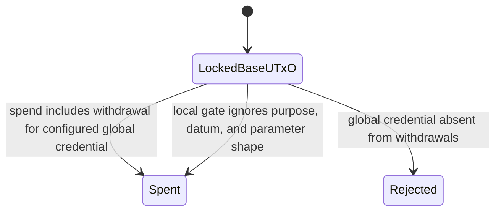
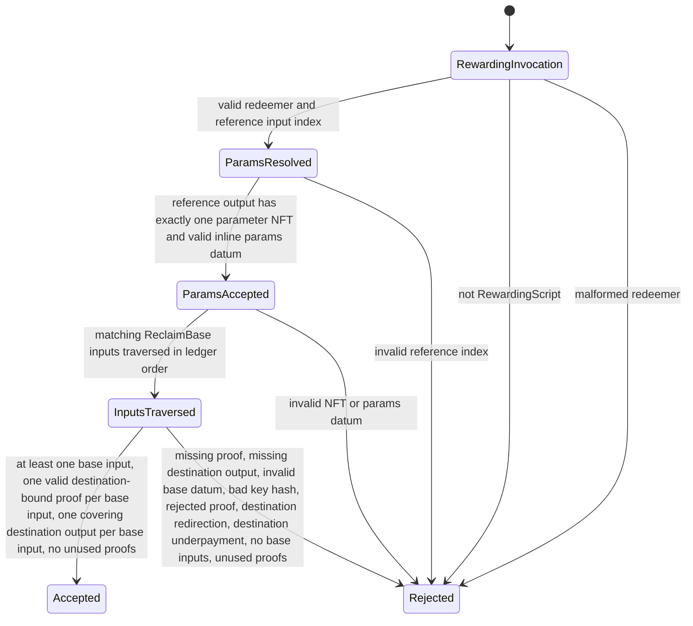

# Reclaim Contract Audit Context

This file provides the context artifacts required by the
`cardano-vulnerability-scanner` skill for the reclaim-base and reclaim-global
contracts.

## Entrypoint Table

| Contract | Entrypoint | File | Purpose | Parameters | Redeemer | Datum |
| --- | --- | --- | --- | --- | --- | --- |
| ReclaimBase | `reclaimBaseValidator` | `contracts/ownership-verifier/src/Ownership/ReclaimBase.hs` | Spending | `Credential` for the global rewarding script | Unit in V3 `scriptContextRedeemer` | `ReclaimBaseDatum { reclaimPaymentKeyHash :: BuiltinByteString }` |
| ReclaimBase | `reclaimBaseValidatorUntyped` | `contracts/ownership-verifier/src/Ownership/ReclaimBase.hs` | Spending wrapper | `Credential` | Encoded inside V3 `ScriptContext` | Inline datum from `SpendingScript _ (Just datum)` |
| ReclaimGlobalV2 | `reclaimGlobalValidatorV2` | `contracts/ownership-verifier/src/Ownership/ReclaimGlobalV2.hs` | Rewarding | Parameter NFT `CurrencySymbol` and `TokenName`; 672-byte verifier key; 32-byte verifier-key hash | Constructor 0 with parameter index, destination-output start index, full-proof list, and public-input-digest list | Parameter UTxO inline `ReclaimGlobalParams`; base input inline `ReclaimBaseDatum`; corresponding destination output |
| ReclaimGlobalV2 | `reclaimGlobalValidatorV2Untyped` | `contracts/ownership-verifier/src/Ownership/ReclaimGlobalV2.hs` | Rewarding wrapper | Same four parameters | Encoded inside V3 `ScriptContext` | Same as typed entrypoint |

## State Graph

### ReclaimBase

### ReclaimGlobalV2

## Branch Cards

### ReclaimBase Branches

| Branch | Predicate | Accepts When | Rejects When |
| --- | --- | --- | --- |
| Withdrawal present | `hasReclaimWithdrawal globalCredential ctx` | `globalCredential` is a key in `txInfoWdrl` | Credential absent; amount is ignored |
| Ignored local fields | No branch | Any `ScriptInfo`, datum presence/shape, or credential width | Never rejected locally; GlobalV2 owns credential/proof validation |
| Deployment credential shape | Off-chain deployment audit | Applied parameter is the intended GlobalV2 script credential | Not checked by ReclaimBase at execution time |

### ReclaimGlobalV2 Branches

| Branch | Predicate | Accepts When | Rejects When |
| --- | --- | --- | --- |
| Purpose | `scriptContextScriptInfo` | Current purpose is `RewardingScript _` | Any other script purpose |
| Redeemer decode | Raw constructor field extraction | Contains parameter index, destination start index, proof list, and digest list in the V2 positions | Malformed or missing fields |
| Parameter ref index | `findReferenceInputAt reclaimParamsIdx txInfoReferenceInputs` | Index is non-negative and in bounds | Negative or out of bounds |
| Parameter NFT | `hasExactlyOneParamToken paramsCurrencySymbol paramsOut` | The parameter output contains one token with quantity `1` under the configured currency symbol | Missing symbol, multiple token names under symbol, or quantity not `1` |
| Parameter datum | `decodeParams paramsOut` | Parameter output has inline datum decodable as `ReclaimGlobalParams` | Missing datum, datum hash only, or malformed datum |
| Base input match | `isReclaimBaseInput reclaimBaseScriptHash txIn` | Input resolved output address is `ScriptCredential reclaimBaseScriptHash` | Non-base inputs are skipped |
| Slot consumption | `validateReclaimInputsV2` | Exactly one full proof, digest, and destination output consumed per matching base input, in ledger order | Missing or unused slot material, zero base inputs, or output-order mismatch |
| Destination output consumption | `validateReclaimInputsV2` | Exactly one destination output consumed per matching base input, starting at `reclaimDestinationOutStartIdx` | Negative/out-of-bounds start index, missing destination output, or destination output order mismatch |
| Base datum/statement | `validateReclaimInputsV2` | Base input has inline `ReclaimBaseDatum`, a 28-byte key hash, and the supplied digest equals the domain-separated credential/destination statement | Missing/malformed datum, bad key hash length, wrong digest, or destination substitution |
| Batch proof | `reclaimBatchTranscriptV2`, `foldBatchProof`, `foldBatchScalarState` | Every 336-byte proof participates once in the verifier-key-bound ordered batch and both final verification equations accept | Malformed proof, reordering/substitution, Groth16 failure, or commitment proof-of-knowledge failure |
| Output value policy | `Value.leq` | Corresponding destination output value covers the full input value across all assets | Lovelace underpayment, missing native asset, or insufficient native asset quantity |

## Compliance Matrix

| Requirement | Contract | Implementation Point | Evidence to Check |
| --- | --- | --- | --- |
| Users can lock UTxOs with a datum containing a public key hash | ReclaimBase | `ReclaimBaseDatum` | Datum type has `reclaimPaymentKeyHash :: BuiltinByteString` |
| Base script is parameterized by a withdrawal-map key | ReclaimBase | `reclaimBaseValidatorBuiltin` | Applied parameter is compared directly with `txInfoWdrl` keys |
| Deployment selects the intended GlobalV2 script credential | Deployment audit | Exporter parameter and resulting script hash | One-time configuration evidence; no repeated on-chain shape check |
| Base script requires that credential in withdrawals | ReclaimBase | `hasReclaimWithdrawal` | Map lookup in `txInfoWdrl`; amount ignored |
| Base script does not validate purpose, datum, proofs, destinations, or value | ReclaimBase | `reclaimBaseValidatorBuiltin` | Those responsibilities are centralized in ledger invocation and GlobalV2 |
| Global script is parameterized by exact parameter NFT identity, verifier key, and verifier-key hash | ReclaimGlobalV2 | `reclaimGlobalValidatorV2` | Four validator parameters; exporter rejects a key/hash mismatch |
| Global redeemer contains parameter index, destination start index, ordered full proofs, and ordered statement digests | ReclaimGlobalV2 | `reclaimGlobalRedeemerDataV2` and raw field extraction | Four-field constructor shape |
| Parameter UTxO must be a reference input | ReclaimGlobalV2 | `findReferenceInputAtData` over `txInfoReferenceInputs` | Does not search spending inputs |
| Parameter NFT identifies params datum | ReclaimGlobalV2 | `hasExactlyOneParamTokenData`, `decodeValidatedParams` | Checks exact policy/token and inline datum on the same referenced output |
| Global script traverses tx inputs in ledger order | ReclaimGlobalV2 | `validateReclaimInputsV2` recursion over `txInfoInputs` | Proofs, digests, and destination outputs are consumed in the same recursion |
| Global script verifies every matching base input | ReclaimGlobalV2 | `validateFreshBatchReclaimProofWithDigest` plus final batch checks | Statement digest binds the base datum credential and on-chain destination; each full proof enters the V2 fold |
| Extra or missing proofs/digests fail | ReclaimGlobalV2 | `validateReclaimInputsV2` terminal cases | Rejects missing and unused slot material |
| No-op global withdrawals fail | ReclaimGlobalV2 | `validateReclaimInputsV2` first-slot branch | Rejects zero matching base inputs |
| Reclaimed value goes to proof-bound destination output | ReclaimGlobalV2 | `destinationAddressV1FromTxOutFields`, `valueCoversData`, `validateReclaimInputsV2` | Tests reject changed destination address, wrong destination index, and underpayment |

## Threat Boundary Table

| Actor / Input | Trusted? | Boundary | Contract Responsibilities |
| --- | --- | --- | --- |
| Depositor writing `ReclaimBaseDatum` | Untrusted | Datum can contain arbitrary bytes | GlobalV2 extracts the datum credential, enforces verifier-input width, and binds it to proof and destination; Base ignores it |
| Transaction builder | Untrusted | Can choose inputs, reference inputs, redeemer proof order, destination output start index, withdrawals, outputs, and minted/burned values | Scripts enforce withdrawal presence, parameter ref index, NFT presence, proof coverage, destination binding, destination value coverage, and no unused proofs |
| Parameter NFT UTxO creator | Trusted at deployment | Chooses base script hash | One-shot policy makes NFT unique; global checks referenced NFT and inline base-script-hash datum |
| Deployment operator | Trusted once and audited | Chooses the applied Base withdrawal key and parameter-NFT state | Must bind Base to the intended GlobalV2 credential; Base does not revalidate deployment metadata per spend |
| Parameter holder script | Assumed always-fails | Prevents spending/mutation of parameter UTxO after creation | Global only reads it as reference input |
| Ownership proof bytes | Untrusted public input | Redeemer-supplied proof can be malformed, for another key, or for another destination | Global calls destination-bound verifier against base datum key hash and computed destination address bytes |
| Verifier key bytes | Trusted as script parameter | Public verifier key committed to by the global validator hash | Global parses the key once per invocation and uses it for all proof checks |
| Off-chain proof ordering | Untrusted | Proof/digest list order can mismatch input order | GlobalV2 authenticates the complete ordered transcript and consumes one full proof and digest per matching base input in `txInfoInputs` order |
| Non-base transaction inputs | Untrusted / irrelevant | May be present in same transaction | Global skips inputs not locked by `reclaimBaseScriptHash` |
