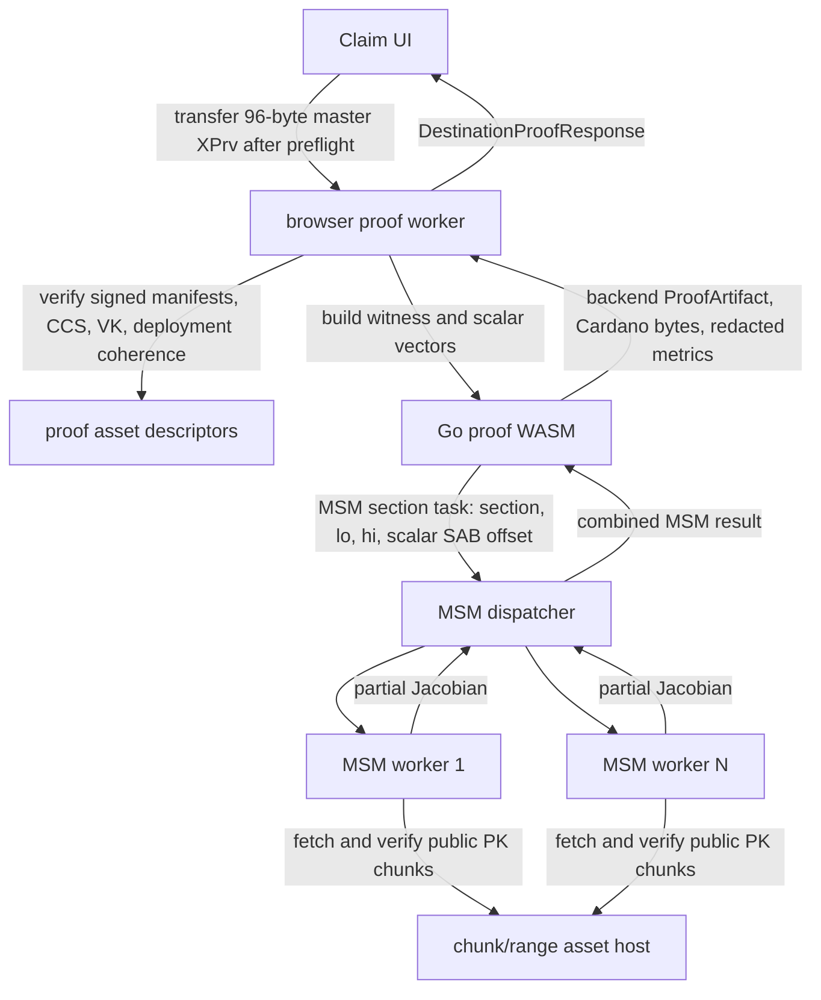

# Worker-Owned Authenticated PK Fetch Design

Date: 2026-07-08

This document designs the browser WASM prover optimization where MSM workers
fetch their own authenticated proving-key ranges and the main prover WASM sends
only scalar material plus public range descriptors. It is intentionally scoped to
proof construction time for the existing destination-bound ownership proof. It
does not change the circuit, the proof claim, the verifier key, the Cardano
proof byte layout, or the reclaim contract path.

## Decision Summary

Build this optimization as an authenticated MSM transport, not as a new proof
format and not as a generic asset loader.

The highest-confidence design is:

1. Add a signed proof-assets chunk manifest that binds fixed raw proving-key
   chunks, the proving-key section index, the CCS, the VK, the Cardano VK, and
   the reclaim deployment identity back to the existing signed key manifest.
2. Move browser proof execution into a dedicated proof worker. The UI transfers
   the 96-byte master XPrv into that worker only after capability and asset
   preflight pass.
3. Extend the experiment prover/MSM boundary so `ProveStream` can request an MSM
   by proving-key section name and scalar vector. The sharded engine dispatches
   work items to MSM workers with `{section, lo, hi, scalarBuffer, scalarOffset}`
   instead of decoded point slices.
4. Let each MSM worker fetch the public PK chunks that cover its point range,
   verify the chunk hashes from the signed chunk manifest, slice the requested
   point bytes, decode once inside the worker, compute the partial MSM, and
   return only the partial Jacobian plus timing data.
5. Pair worker-owned fetch with safe over-sharding or dynamic shard scheduling.
   Worker-owned fetch alone should improve memory pressure and remove main-WASM
   decode/marshal/copy work, but the best chance of reducing wall-clock proving
   time comes from combining it with better worker utilization.

The design is accepted only if it reduces median browser proof construction time
against the best current sharded baseline while preserving local verification,
tamper rejection, artifact shape, and secret handling rules.

## Implementation Result

Status after follow-up tuning: authenticated worker-owned fetch is accepted for
the browser experiment. The first `w=8, shards=32` implementation pass was
correct and fail-closed but missed the proof-time gate; increasing browser MSM
parallelism to `w=16, shards=64` produced a clean full-proof run that beats the
8 percent proof-time target while preserving local verification and artifact
shape.

Verified properties:

- Signed chunk manifests bind the key manifest, deployment manifest, CCS, VK,
  Cardano VK hash, PK section index, PK chunks, `proof-destination.wasm`,
  `worker.js`, and `msmworker.wasm`.
- Browser preflight rejects incoherent or tampered signed assets before proof
  generation.
- MSM workers fetch public PK chunks, verify SHA-256 and BLAKE2b-256 digests,
  slice the requested point bytes, compute partial MSMs, and return timing and
  byte-count traces.
- Full browser proofs verified locally and preserved the existing backend and
  Cardano artifact shape.
- Scalar byte slices and scalar `SharedArrayBuffer`s are zeroed after worker
  consumption.

Accepted run:

```text
case:                    worker-owned, 4 MiB chunks, w=16, shards=64
prove_ms:                355442
wall_seconds:            359.568
peak_heap_gib:           2.771
verified_locally:        true
artifact_schema:         root-ownership-proof-artifact-v1
cardano_artifact:        present
section_events:          320
chunk_size:              4194304
worker_owned_fetched:    3,028,287,488 bytes
worker_owned_used:       1,686,282,432 bytes
```

Repeat evidence:

```text
worker-owned-w16-s64-4m-dynamic:       prove_ms=355442, peak_heap_gib=2.771, contaminated=false
worker-owned-w16-s64-4m-dynamic-run2:  prove_ms=349189, peak_heap_gib=2.766, contaminated=true
worker-owned-w16-s64-4m-dynamic-run3:  prove_ms=346622, peak_heap_gib=2.766, contaminated=true
median prove_ms:                       349189
target prove_ms:                       502906
```

The two repeats were marked contaminated by Codex-app background `npm`/`git`
bookkeeping, so the clean first run remains the strongest standalone benchmark
artifact. All three full proofs verified locally, preserved the artifact shape,
and landed far below the proof-time gate.

Accepted P0 baseline:

```text
case:                    p0-over-w8-s32-rf2
prove_ms:                546637
wall_seconds:            549.767
peak_heap_gib:           2.544
verified_locally:        true
```

The accepted worker-owned run beats the 8 percent improvement gate, which
requires about `502906 ms`, by roughly 147 seconds. Its peak main-WASM heap is
higher than the accepted P0, but `2.771 GiB` is explicitly acceptable per user
steering on 2026-07-08. Further heap reduction remains useful, but it is not an
acceptance blocker for this optimization.

Earlier no-go run:

```text
case:                    worker-owned, 4 MiB chunks, w=8, shards=32
prove_ms:                560677
wall_seconds:            563.866
peak_heap_gib:           2.634
verified_locally:        true
section_events:          160
chunk_size:              4194304
worker_owned_fetched:    2,357,198,848 bytes
worker_owned_used:       1,686,282,432 bytes
```

Follow-up details:

- Dynamic one-outstanding-task-per-worker scheduling verified locally but was
  slower than fixed scheduling for the 4 MiB chunk run: `prove_ms=569180`,
  `peak_heap_gib=2.750`.
- A Node MSM worker probe justified the higher-worker full proof: for
  `N=100000`, `WORKERS=8`, `SHARDS=32` had worker phase `3966.7 ms`, while
  `WORKERS=16`, `SHARDS=64` had worker phase `2447.7 ms`.
- A stricter memory attempt with `GOMEMLIMIT=2500MiB` and `GOGC=5` failed before
  producing benchmark evidence with `Execution context was destroyed`; do not
  use that as accepted proof evidence.
- Routing commitment `Basis` and `BasisExpSigma` through worker-owned section
  MSM inside gnark solver hints crashed Go WASM with `fatal error: found bad
  pointer in Go heap`; do not retry that shape without restructuring the
  commitment proof outside async solver-hint work.
- Scalar marshal plus SAB copy totalled only about 1.5 seconds across the
  dynamic 4 MiB run, so scalar SAB reuse cannot plausibly close a roughly
  58-second target gap by itself.
- Worker-side public chunk caching would reduce repeat fetch/hash overhead, but
  localhost fetch/hash sums are also too small to close the full performance
  gap alone. Caching remains useful for hosted latency, retries, and UX, not as
  sufficient evidence for promotion.

Conclusion: keep the signed chunk manifest, preflight, and worker-owned
section-fetch path as the accepted browser-experiment optimization at
`w=16, shards=64` with the current 4 MiB signed bundle. Production webapp
promotion remains a separate integration decision because it changes the
user-facing secret-entry surface.

## Current Evidence

The isolated browser WASM experiment already generated and locally verified a
real destination-bound proof with current preprod proof assets. The recorded
baseline is:

```text
engine:                  streampk-sharded-groth16
worker_count:            8
shard_count:             8
range_fetch_concurrency: 4
wall_seconds:            587.62
prove_ms:                583711
peak_heap_gib:           2.636
pk_range_requests:       50
pk_range_bytes:          2,079,485,485
verified_locally:        true
```

The important timing fact is that proof construction is dominated by MSM stages:

```text
G2B: 113.235s
Z: 109.153s
A: 100.676s
B: 69.304s
K: 53.745s
solver: 52.851s
commitment BasisExpSigma MSM: 49.074s
commitment Basis MSM: 47.783s
computeH / FFT: 31.465s
open-ccs: 2.796s
find-path: 0.022s
verify: 0.015s
serialize artifact: 0.001s
```

The current ranged MSM path still does this:

```text
HTTP PK range bytes
  -> main WASM decodes into []G1Affine or []G2Affine
  -> main WASM marshals those points back to raw worker bytes
  -> main WASM copies point bytes into SharedArrayBuffer
  -> MSM worker copies/unmarshals
  -> MSM worker computes partial MultiExp
```

Worker-owned PK fetch removes the first three point-data steps from the main
prover worker. That is a real target, but it is not automatically a large
wall-clock win because worker compute remains the largest bucket. Therefore the
implementation must measure per-shard fetch, hash, decode, scalar copy, queue,
compute, and combine time before and after the change.

## Non-Goals

- Do not change `internal/circuit/ownershipdest` or reduce circuit size as part
  of this optimization.
- Do not change proof artifact schema, `cardano.proof_hex`, or
  `cardano.public_input_digest_hex`.
- Do not accept proof assets that are not signed, pinned, and coherent with the
  deployment verifier hash.
- Do not silently create browser-local proving keys.
- Do not send seed phrases, master XPrvs, witness values, path metadata, or full
  proof requests to hosted services, URLs, logs, local storage, session storage,
  analytics, or e2e artifacts.
- Do not treat a faster fixture-mode proof as proof of production readiness.
- Do not promote a dirty vendored gnark patch as a production dependency without
  a reviewed fork, replacement, or upstreamed change.

## Browser Platform Assumptions

The design relies on standard browser primitives:

- Dedicated workers can fetch network resources and keep long work off the UI
  thread.
- HTTP range requests should return `206 Partial Content`; a `200 OK` response
  means the server did not serve the requested range and must be rejected on the
  production browser proving path.
- `SharedArrayBuffer` requires a secure, cross-origin-isolated context.
- Cache storage is available to workers in secure contexts, but cache lifetime is
  browser-managed and must be treated as an optimization, not a correctness
  dependency.

Reference docs:

- [WorkerGlobalScope.fetch](https://developer.mozilla.org/en-US/docs/Web/API/WorkerGlobalScope/fetch)
- [HTTP range requests](https://developer.mozilla.org/en-US/docs/Web/HTTP/Guides/Range_requests)
- [SharedArrayBuffer](https://developer.mozilla.org/en-US/docs/Web/JavaScript/Reference/Global_Objects/SharedArrayBuffer)
- [Cross-Origin-Opener-Policy](https://developer.mozilla.org/en-US/docs/Web/HTTP/Reference/Headers/Cross-Origin-Opener-Policy)
- [Cross-Origin-Embedder-Policy](https://developer.mozilla.org/en-US/docs/Web/HTTP/Reference/Headers/Cross-Origin-Embedder-Policy)
- [Cache API](https://developer.mozilla.org/en-US/docs/Web/API/Cache)

## Trust Model

The transport is not the trust root. HTTPS, GitHub Releases, a CDN, and browser
HTTP cache are convenience layers only.

The trust root for proof assets is:

1. A trusted, out-of-band pinned Ed25519 release signing public key.
2. The signed key `manifest.json` already used by the repo.
3. A new signed chunk manifest whose coherence fields match the key manifest and
   reclaim deployment manifest.
4. Per-chunk hashes checked before point bytes are decoded or passed into MSM.

The hosted website remains a trust boundary. A malicious hosted frontend can
still exfiltrate secrets before browser proving begins. This optimization does
not solve hosted-JS mutability. It preserves the existing rule that secrets stay
local to the browser/proof worker path during honest operation.

## Signed Chunk Manifest

Add a new signed JSON artifact:

```text
proof-tool-proof-assets-chunk-manifest-v1
```

Keep the existing signed key manifest as the key identity source. The chunk
manifest binds chunked/ranged browser artifacts to it.

Recommended schema:

```json
{
  "schema": "proof-tool-proof-assets-chunk-manifest-v1",
  "release": "proof-assets-ownership-destination-v1-mainnet-...",
  "profile": "mainnet-single-destination",
  "generated_at": "RFC3339",
  "coherence": {
    "key_manifest_sha256": "sha256:...",
    "key_manifest_blake2b256": "blake2b256:...",
    "key_version": "ownership-destination-v1",
    "circuit_id": "root-ownership-destination-v1/bls12-381/groth16",
    "vk_hash": "blake2b256:...",
    "proving_key_size": 2079485517,
    "proving_key_sha256": "sha256:...",
    "proving_key_blake2b256": "blake2b256:...",
    "verifying_key_sha256": "sha256:...",
    "verifying_key_size": 784,
    "constraint_system_hash": "blake2b256:...",
    "setup_transcript_hash": "blake2b256:...",
    "circuit_source_commit": "...",
    "gnark_version": "v0.15.0",
    "proof_tool_version": "0.1.0",
    "cardano_vk_format": "groth16-bls12-381-bsb22",
    "cardano_vk_blake2b256": "blake2b256:...",
    "deployment_id": "mainnet:...",
    "deployment_source_commit": "..."
  },
  "transport": {
    "base_url": "https://assets.example/proof-assets/...",
    "content_encoding": "identity",
    "requires_https": true,
    "supports_range": true
  },
  "proving_key": {
    "path": "ownership.pk",
    "chunk_size": 16777216,
    "chunks_root_blake2b256": "blake2b256:...",
    "chunks": [
      {
        "index": 0,
        "offset": 0,
        "size": 16777216,
        "path": "ownership.pk.part0000",
        "sha256": "sha256:...",
        "blake2b256": "blake2b256:..."
      }
    ]
  },
  "proving_key_index": {
    "schema": "proof-tool-proving-key-index-v1",
    "file_size": 2079485517,
    "sha256": "sha256:...",
    "blake2b256": "blake2b256:...",
    "sections": [
      {
        "name": "A",
        "offset": 461,
        "len": 362814048,
        "elem_size": 96
      }
    ]
  },
  "assets": {
    "ownership.vk": {
      "path": "ownership.vk",
      "size": 784,
      "sha256": "sha256:...",
      "blake2b256": "blake2b256:..."
    },
    "ownership-destination.ccs": {
      "path": "ownership-destination.ccs",
      "size": 187120157,
      "sha256": "sha256:...",
      "blake2b256": "blake2b256:..."
    }
  },
  "signature": {
    "alg": "Ed25519",
    "signature_key_id": "...",
    "public_key_hex": "...",
    "signature_hex": "..."
  }
}
```

The canonical signed bytes should omit the embedded `signature` object, or the
repo should use the same detached-signature convention as `manifest.json`. Pick
one format and make tests prove tampering fails. Detached signatures match the
existing repo pattern and are the safer default:

```text
chunk-manifest.json
chunk-manifest.sig
chunk-manifest-public-key.hex
```

Production verification must use an out-of-band trusted public key. Reading
`chunk-manifest-public-key.hex` from the same asset bundle may check integrity of
a self-contained bundle, but it does not establish signer trust.

## Chunk Size

Use fixed raw PK chunks of 16 MiB for the first implementation, aligned down to
both G1 and G2 point sizes where practical. Permit an 8 MiB and 32 MiB benchmark
matrix before freezing the release format.

Reasoning:

- The current PK is about 2.08 GB. A 16 MiB chunk size yields about 124 chunks,
  which keeps the manifest small while giving workers useful cache granularity.
- A single 8-shard G2B range is about 60.9 MB, so 16 MiB chunks let a worker
  fetch 4 chunks instead of one very large range.
- 16 MiB chunk verification cost should be small enough to overlap with network
  and scheduling, and large enough to avoid thousands of tiny requests.
- The final chunk may be shorter. All chunks must be ordered, contiguous, and
  cover exactly `proving_key_size`.

Do not gzip, brotli, or otherwise content-encode PK chunks. Hashes and offsets
are over raw bytes.

## Verification Rules

The browser proof worker must verify:

- Chunk manifest signature.
- `signature_key_id` and signer public key match the pinned release descriptor.
- Key manifest digest in chunk manifest matches the fetched key manifest.
- Key manifest signature verifies against the pinned signer public key.
- `key_version`, `circuit_id`, `vk_hash`, `constraint_system_hash`, PK size and
  hashes, VK size and hashes, setup transcript hash, source commit, deployment
  id, and Cardano VK hash are coherent across:
  - key manifest,
  - chunk manifest,
  - reclaim deployment manifest,
  - expected app configuration.
- Proving-key index sections are valid:
  - required sections `A`, `B`, `Z`, `K`, `G2B`, `Basis`, `BasisExpSigma`,
  - section names match map keys,
  - offsets and lengths are non-negative,
  - lengths are divisible by `elem_size`,
  - element size is exactly 96 for G1 or 192 for G2,
  - sections stay within `proving_key_size`.
- Chunk table is valid:
  - chunks are sorted by `index`,
  - offsets are contiguous,
  - sizes are positive except no zero-sized chunks,
  - final `offset + size` equals `proving_key_size`,
  - paths are safe relative paths, with no absolute path, URL, `..`, backslash
    traversal, or query-derived alternate.

Each MSM worker must verify every fetched chunk against the signed chunk table
before decoding point bytes. It may trust the proof worker's Ed25519 signature
verification result if the proof worker sends an immutable `pkPlan` constructed
from verified manifests. It must still re-check chunk hash, chunk size, range
coverage, and section bounds locally before computing.

Production worker fetch should reject:

- `200 OK` responses to range requests for exact ranges.
- Wrong or missing `Content-Range`.
- Wrong byte count.
- Any content encoding other than `identity`.
- Redirects to a different origin unless the release descriptor explicitly pins
  that origin.
- Chunks whose digest does not match the signed manifest.

## Proposed Runtime Architecture



The UI should never instantiate `proof-destination.wasm` directly. It should
start a provider worker, transfer the master key buffer, receive redacted
progress, and receive the normalized `DestinationProofResponse`.

The proof worker owns:

- manifest and deployment preflight,
- witness construction,
- path search,
- scalar vector construction,
- scalar encoding into `SharedArrayBuffer`,
- proof assembly,
- local verification,
- artifact serialization,
- zeroing scalar/key buffers on completion or failure.

The MSM workers own:

- public PK chunk fetching,
- public PK chunk hash verification,
- point byte slicing,
- point decoding,
- single-shard MultiExp,
- returning partial Jacobians and non-secret timing metrics.

The main browser UI owns:

- capability display,
- method selection,
- phrase input,
- transferring the master key into the proof worker,
- rendering progress,
- validating provider output through the existing claim-flow gate.

## MSM Engine Interface Change

The current `MSMG1Ranged` and `MSMG2Ranged` signatures accept a fetch closure
that returns decoded Go point slices. That makes the main prover WASM the owner
of PK range fetch and point decode.

Add a section-aware optional engine interface:

```go
type PKSectionPlan struct {
    AssetID       string
    PKURL         string
    FileSize      int64
    ChunkSize     int64
    Sections      map[string]Section
    Chunks        []ChunkPin
    ManifestHash  string
    VKHash        string
}

type PKSectionEngine interface {
    MSMG1Section(
        dst *bls12381.G1Jac,
        plan *PKSectionPlan,
        section string,
        n int,
        scalars []fr.Element,
        prog ProgressFn,
    ) error

    MSMG2Section(
        dst *bls12381.G2Jac,
        plan *PKSectionPlan,
        section string,
        n int,
        scalars []fr.Element,
        prog ProgressFn,
    ) error
}
```

Then update the vendored/experimental `ProveStream` fork at each ranged MSM
call:

```go
if sectionEngine, ok := msmengine.Current().(msmengine.PKSectionEngine); ok {
    err = sectionEngine.MSMG1Section(&ar, src.PKSectionPlan(), "A", len(wireValuesA), wireValuesA, nil)
} else {
    err = msmengine.Current().MSMG1Ranged(&ar, len(wireValuesA), func(lo, hi int) ([]curve.G1Affine, error) {
        return src.G1Range("A", lo, hi, nil)
    }, wireValuesA, nil)
}
```

Keep the existing decoded-ranged path as the CPU/debug fallback until the
worker-owned path has repeated proof verification and tamper evidence.

Do not make `PKSectionPlan` client-supplied. It must be built only from verified
manifests and deployment pins.

## Worker Message Contract

Initialize each MSM worker once:

```json
{
  "type": "init",
  "wasmURL": "/proof-assets/msmworker.wasm",
  "pkPlan": {
    "asset_id": "blake2b256:853b...",
    "base_url": "https://assets.example/proof-assets/...",
    "file_size": 2079485517,
    "chunk_size": 16777216,
    "sections": {
      "A": { "offset": 461, "len": 362814048, "elem_size": 96 }
    },
    "chunks": [
      {
        "index": 0,
        "offset": 0,
        "size": 16777216,
        "path": "ownership.pk.part0000",
        "sha256": "sha256:...",
        "blake2b256": "blake2b256:..."
      }
    ]
  }
}
```

Dispatch one MSM range task:

```json
{
  "type": "msm-range",
  "id": 42,
  "group": "g1",
  "section": "A",
  "lo": 0,
  "hi": 1181182,
  "scalar_buffer": "SharedArrayBuffer",
  "scalar_offset": 0,
  "scalar_count": 1181182,
  "scalar_size": 32
}
```

Successful response:

```json
{
  "id": 42,
  "partial": "Uint8Array",
  "timings": {
    "cache_ms": 0.0,
    "fetch_ms": 120.0,
    "hash_ms": 16.0,
    "slice_ms": 3.0,
    "decode_ms": 250.0,
    "compute_ms": 11300.0,
    "total_ms": 11689.0
  },
  "bytes": {
    "fetched": 134217728,
    "used": 113393472
  }
}
```

Failure response:

```json
{
  "id": 42,
  "error": "chunk 17 blake2b256 mismatch"
}
```

The worker must include the request id in every response. The dispatcher must
demultiplex replies by id and must support multiple outstanding requests per
worker before over-sharding is benchmarked.

## Worker Fetch Algorithm

For a task `{section, lo, hi}`:

1. Load section metadata from `pkPlan.sections[section]`.
2. Confirm `lo >= 0`, `hi >= lo`, and `hi <= section.len / elem_size`.
3. Compute byte range:

   ```text
   start = section.offset + lo * elem_size
   end_exclusive = section.offset + hi * elem_size
   ```

4. Find all chunks intersecting `[start, end_exclusive)`.
5. For each chunk:
   - check cache by `{asset_id, chunk_size, chunk_index, blake2b256}`,
   - if absent, fetch exact chunk path or exact chunk range,
   - require status `206` for range fetches,
   - require byte count equals chunk size,
   - hash chunk with BLAKE2b-256 and SHA-256,
   - compare both digests to the signed chunk manifest,
   - store verified chunk bytes in Cache API or IndexedDB/OPFS if enabled.
6. Copy only the needed slice from each verified chunk into a contiguous
   `pointsRaw` buffer.
7. Confirm `pointsRaw.length == (hi - lo) * elem_size`.
8. Pass `pointsRaw` and the scalar SAB view into the worker WASM kernel.
9. Zero temporary scalar copies after `MultiExp` returns. Point bytes are public
   but should still be released promptly to reduce peak heap.

A point range may touch more chunk bytes than it uses, especially at chunk
edges. Trace both fetched bytes and used point bytes so chunk-size tuning can
separate useful transfer from overfetch.

## Scheduling Strategy

The first implementation should keep one task outstanding per worker, but it
must implement request-id demux immediately. Then benchmark these modes:

```text
fixed-8:      workers=8,  shards=8
fixed-16:     workers=8,  shards=16
fixed-24:     workers=8,  shards=24
fixed-32:     workers=8,  shards=32
dynamic-16m:  workers=8,  target point ranges around 16 MiB of point bytes
dynamic-8m:   workers=8,  target point ranges around 8 MiB of point bytes
```

Dynamic scheduling should use a work queue per MSM:

1. Partition the MSM into many contiguous point ranges.
2. Start at most one compute task per worker.
3. When a worker returns a partial, immediately assign the next range.
4. Combine all partials in deterministic range order.

This attacks tail imbalance. It also makes chunk cache reuse more likely because
neighboring smaller ranges share containing chunks.

Do not assume a single worker can prefetch while its Go WASM MultiExp is running.
If hosted latency becomes material after the first worker-owned implementation,
add a separate fetcher queue or prefetch workers:

```text
fetch workers -> verified ArrayBuffers -> compute workers -> partials
```

That is a second-stage optimization, not the first worker-owned fetch design.

## Scalar Transport

The main proof worker still owns secret-derived scalar vectors. To reduce scalar
copy pressure:

1. Encode scalars once per MSM into a `SharedArrayBuffer`.
2. Send scalar offsets and counts to each worker instead of per-shard scalar
   buffers.
3. Reuse the same scalar SAB for `G2B` and `B` because both use `wireValuesB`.
4. Reuse the same scalar SAB for `Basis` and `BasisExpSigma` commitment MSMs
   when they consume the same committed scalars.
5. Zero scalar SAB contents as soon as the final consumer returns.

This is part of the recommended design because worker-owned point fetch alone
still leaves per-shard scalar marshal/copy work in the main prover. Scalar reuse
is smaller than point movement, but it is low-risk if tests prove exact ordering.

Progress and traces must never include scalar values.

## Caching

Chunk caching is useful for repeat proofs, retries, and hosted asset latency. It
should not be required for correctness.

Recommended cache key:

```text
proof-pk-chunk-v1:
  pk_blake2b256
  chunk_size
  chunk_index
  chunk_blake2b256
```

Acceptable storage backends:

- Cache API for browser simplicity.
- IndexedDB or OPFS for explicit binary chunk storage if Cache API behavior is
  hard to control.
- HTTP cache only as a fallback.

Never cache:

- seed phrase,
- master XPrv,
- witness values,
- scalar buffers,
- derivation path,
- full proof request JSON.

Cache eviction must be harmless. If a chunk is absent, fetch and verify it again.

## Implementation Plan

### Phase 0: Evidence And Instrumentation

Add or verify per-shard trace fields before changing transport:

```text
operation
section
group
shard_index
worker_id
range_lo
range_hi
point_count
point_bytes
scalar_bytes
queue_wait_ms
fetch_ms
hash_ms
decode_ms
marshal_ms
sab_copy_ms
worker_turnaround_ms
worker_compute_ms
combine_ms
total_ms
error
```

Fix worker reply demux or per-worker request queuing before benchmarking
`shards > workers`. Add a test where two requests to the same worker complete
out of order and the dispatcher still resolves the right promises.

Acceptance:

```text
go test ./experiments/wasm-prover/...
GOROOT="$(go env GOROOT)" N=2000 WORKERS=4 node experiments/wasm-prover/web/node-msm-check/run.mjs
one browser proof verifies with per-shard timing in trace
```

### Phase 1: Signed Chunk Manifest Generator

Add a command, likely under `cmd/proof-tool`, that:

1. Starts from a verified key bundle directory.
2. Runs the existing key-bundle verification path.
3. Reads the reclaim deployment manifest.
4. Asserts `proof.vk_hash`, `reclaim_global.verifier_vk_hash`, and generated
   Cardano VK hash match.
5. Generates the proving-key section index.
6. Generates the serialized CCS if needed and records its hash.
7. Splits `ownership.pk` into fixed raw chunks.
8. Hashes every chunk with SHA-256 and BLAKE2b-256.
9. Writes `chunk-manifest.json`.
10. Signs exact manifest bytes with the release Ed25519 key.
11. Verifies the signed output before returning.

Acceptance:

```text
go test ./cmd/proof-tool ./internal/artifact ./experiments/wasm-prover/...
chunk-manifest tamper tests fail for signature, chunk digest, section offset, vk_hash, deployment id
```

### Phase 2: Main-Owned Raw Transport Spike

Before full worker-owned fetch, optionally add a raw point transport mode where
the proof worker fetches raw range bytes and sends them to MSM workers without
main-WASM point decode/remarshal.

This is a stepping stone only. It proves raw PK bytes match the worker point
format and separates point decode cost from network/hash cost.

Acceptance:

```text
native test: raw range bytes == decoded+marshal bytes for G1 and G2
Node worker bit-exact check passes
browser proof verifies
tamper checks fail
```

If this spike is slower, keep the raw-byte equality tests and move on. Do not
promote it as the final optimization.

### Phase 3: Worker-Owned Authenticated Fetch

Add the section-aware MSM engine path and worker message contract. Workers fetch
and verify chunks themselves.

Acceptance:

```text
browser proof verifies with worker-owned fetch
worker trace includes fetch_ms, hash_ms, decode_ms, compute_ms
no point bytes are copied from proof worker to MSM worker
production path rejects 200 OK for range fetches
tamper checks fail
```

### Phase 4: Dynamic Scheduling And Scalar Reuse

Add:

- request-id reply demux,
- dynamic range queue per MSM,
- scalar SAB reuse for repeated scalar vectors,
- benchmark matrix for chunk sizes and range sizes.

Acceptance:

```text
median prove_ms improves by at least 8 percent over the best current sharded baseline
peak main-WASM heap does not regress
local verification true
tamper checks fail
```

Use 8 percent as the first go/no-go threshold because proof-time runs are long
and noisy. A smaller win may still be useful for memory, but it is not enough to
claim this optimization substantially improves proof construction time.

### Phase 5: Production-Shaped Webapp Integration

Only after the experiment passes the benchmark gate:

- Move the provider into `apps/ownership-proof-web/lib/proving/browser-wasm`.
- Keep Proof Helper Desktop as the default stable fallback.
- Gate browser proving on capability and signed asset preflight before phrase
  entry.
- Keep the existing `validateDestinationProofResponse` gate.
- Add e2e evidence that browser-WASM artifacts can build claim transactions
  through the same backend path as desktop-helper artifacts.

## Benchmark Matrix

Run paired, alternating cases so thermal/load drift does not dominate:

```text
baseline-current:       w=8, shards=8, rf=4
baseline-over-sharded:  w=8, shards=16/24/32 after reply demux
main-owned-raw:         w=8, best shard count
worker-owned-cold-8m:   w=8, chunk=8 MiB
worker-owned-cold-16m:  w=8, chunk=16 MiB
worker-owned-cold-32m:  w=8, chunk=32 MiB
worker-owned-warm-16m:  w=8, chunk=16 MiB
worker-owned-dynamic:   w=8, dynamic range queue, chunk=16 MiB
worker-owned-scalar:    dynamic plus scalar SAB reuse
```

Record:

```text
prove_ms
wall_seconds
peak main heap
peak worker heap if measurable
worker_count
shard_count
chunk_size
range task size
range requests
range bytes fetched
range bytes used
cache hit ratio
fetch_ms
hash_ms
decode_ms
marshal_ms
sab_copy_ms
worker_compute_ms
queue_wait_ms
combine_ms
verified_locally
tamper_check_result
```

Do not compare a cold-cache run to a warm-cache baseline. Report both.

## Expected Impact

Expected impact by layer:

| Change | Expected proof-time impact | Confidence | Notes |
| --- | ---: | --- | --- |
| Reply demux plus safe over-sharding | 5 to 12 percent | Medium/high | Highest-confidence wall-clock lever because it attacks worker utilization and tail imbalance. |
| Main-owned raw point transport | -3 to 8 percent | Medium | Useful stepping stone; may be noisy or slower if extra JS copies dominate. |
| Worker-owned authenticated point fetch | 4 to 12 percent | Medium | Removes main point decode/marshal/SAB copy and lowers main heap pressure. |
| Worker-owned fetch plus dynamic queue | 8 to 18 percent | Medium | Best chance of a visible proof-time win. |
| Scalar SAB reuse | 1 to 6 percent | Medium/low | Mostly reduces repeated scalar allocations/copies. |
| Warm public chunk cache | 0 to 8 percent for localhost, higher for hosted/retry | Medium | More UX/network benefit than compute benefit. |
| Fetcher-worker pipeline | 0 to 10 percent | Low until hosted latency is measured | Add only if worker-owned cold runs show fetch latency on the critical path. |

The realistic target is reducing a 587 second proof to roughly 490 to 540
seconds without increasing peak memory or weakening validation. A larger win
probably requires a different MSM implementation, WebGPU, circuit changes, or
native helper use. Those are outside this design.

## Security Tests

Add negative tests for:

- chunk manifest signature tamper,
- chunk digest tamper,
- chunk size tamper,
- non-contiguous chunk table,
- section offset tamper,
- section `elem_size` tamper,
- stale deployment id,
- wrong `vk_hash`,
- wrong Cardano VK hash,
- wrong CCS hash,
- `200 OK` response to range fetch,
- wrong `Content-Range`,
- truncated chunk body,
- cache poisoning with valid URL and wrong bytes,
- worker task with out-of-bounds `lo`/`hi`,
- worker task with section not in signed plan,
- proof artifact with `path` or `paths`,
- proof artifact target credential mismatch,
- proof artifact destination mismatch.

The expected result is fail-closed before proof generation for asset/coherence
problems, and fail-closed before backend build for artifact problems.

## Files Likely To Change

Experiment and proof transport:

```text
internal/streampk/
internal/streamprove/
internal/msmengine/
cmd/msmworker/
cmd/wasm-prover/
experiments/wasm-prover/web/worker.js
vendor/github.com/consensys/gnark/backend/groth16/bls12-381/prove.go
```

Artifact generation and verification:

```text
cmd/proof-tool/
internal/artifact/
internal/prover/
apps/proof-helper-desktop/src-tauri/key-bundle-core/src/lib.rs
apps/proof-helper-desktop/src-tauri/src/proof_assets_release.rs
```

Production webapp integration, only after experiment gates pass:

```text
apps/ownership-proof-web/lib/proving/
apps/ownership-proof-web/components/ClaimFlow.tsx
apps/ownership-proof-web/e2e/preprod/
```

## Open Questions

1. Should production chunk assets be served as separate `ownership.pk.partNNNN`
   files, or as range requests against a monolithic `ownership.pk` with per-chunk
   hash verification? Separate files simplify CDN behavior and digest checking;
   monolithic range requests keep release artifacts closer to the current key
   bundle. Benchmark both only if hosting constraints make the choice unclear.
2. Should chunk signature be detached like `manifest.sig`, or embedded in the
   chunk manifest? Detached matches existing repo practice.
3. Should browser signature verification use Go WASM only, or should the webapp
   add a TypeScript Ed25519 verifier for preflight before loading Go WASM? Go
   WASM reduces dependency drift. TypeScript preflight can improve UX but must
   not become the only verifier.
4. Can the current gnark fork expose a cleaner upstreamable `VectorSource` and
   section-aware MSM hook, or does production need to carry a maintained fork?
5. What is the hosted range latency and cache behavior under the real asset host?
   Localhost proof timings are not enough for the final release decision.

## Final Recommendation

Proceed with worker-owned PK fetch only as part of the combined
`authenticated chunks + section-aware MSM + dynamic scheduling + scalar SAB reuse`
track.

Do not spend the implementation budget on worker-owned fetch as a standalone
asset-loading cleanup. The measured proof is compute/MSM dominated; a standalone
fetch refactor may make the architecture cleaner without materially reducing
proof time. The design has the best chance of improving proof construction time
when it also improves worker utilization and removes repeated point/scalar
marshalling on the critical MSM path.

Promotion criteria:

```text
browser proof verifies locally
all tamper checks fail closed
median prove_ms improves by >= 8 percent against the best current sharded baseline
main-WASM peak heap does not regress
no secret-bearing value appears in URLs, storage, logs, progress, or non-local requests
proof artifacts still pass validateDestinationProofResponse
desktop helper fallback remains available
```

If the benchmark fails the proof-time threshold but improves memory materially,
keep the worker-owned fetch path as an experimental memory/hosted-asset
improvement and continue to treat Proof Helper Desktop as the production proving
path.
